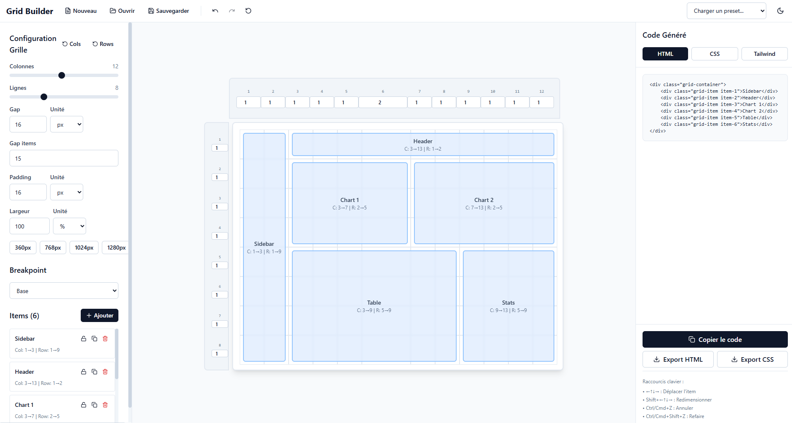

# CSS Grid Builder

Un générateur de grilles CSS interactif avec alignement pixel-perfect et export de code.


## 📸 Aperçu

<div align="center">
  
  <p><em>Interface complète avec sidebar de configuration, prévisualisation de grille et export de code</em></p>
</div>

## 🎯 Fonctionnalités

- **Interface drag & drop** intuitive pour créer des layouts CSS Grid
- **Alignement pixel-perfect** entre l'overlay visuel et les items
- **Contrôles `fr` dynamiques** pour ajuster les tailles de colonnes/lignes
- **Gap visuel** avec système de margins intelligent
- **Snapping automatique** des items sur la grille
- **Export de code** en HTML, CSS et Tailwind
- **Interface responsive** avec contrôles alignés
- **Mode sombre/clair** automatique

## 🚀 Installation

### Prérequis

- Node.js 18+ 
- npm ou yarn

### Installation locale

1. **Cloner le repository**
```bash
git clone https://github.com/votre-username/grid-builder.git
cd grid-builder
```

2. **Installer les dépendances**
```bash
npm install
```

3. **Lancer le serveur de développement**
```bash
npm run dev
```

4. **Ouvrir dans le navigateur**
```
http://localhost:5173
```

### Scripts disponibles

```bash
# Développement
npm run dev

# Build de production
npm run build

# Preview du build
npm run preview

# Linting
npm run lint
```

## 🎨 Utilisation

### Interface principale

1. **Header** : Contrôles des colonnes (`fr` values)
2. **Sidebar** : Contrôles des lignes (`fr` values)  
3. **Surface** : Grille interactive avec overlay

### Création d'items

- **Clic sur la grille** : Ajouter un nouvel item
- **Drag & drop** : Déplacer un item
- **Handles** : Redimensionner un item
- **Clavier** : Navigation avec les flèches

### Contrôles

- **Gap items** : Espacement visuel entre items (px)
- **Padding** : Marge interne du conteneur
- **Dimensions** : Largeur/hauteur du conteneur
- **Colonnes/Lignes** : Valeurs `fr` pour chaque track

### Export de code

- **HTML** : Structure basique
- **CSS** : Styles complets avec `calc()` pour les gaps
- **Tailwind** : Classes utilitaires
- **Fichier complet** : HTML standalone

## 🏗️ Architecture technique

### Structure du projet

```
src/
├── components/          # Composants React
│   ├── UnifiedGridCanvas.tsx    # Canvas principal
│   ├── PerfectGridOverlay.tsx   # Overlay de grille
│   ├── SidebarControls.tsx      # Contrôles sidebar
│   └── CodePanel.tsx            # Panel d'export
├── lib/                 # Logique métier
│   ├── unifiedGridEngine.ts     # Moteur de grille unifié
│   ├── unifiedCodeGenerator.ts  # Générateur de code
│   └── utils.ts                 # Utilitaires
├── store/               # État global
│   └── gridStore.ts            # Store Zustand
└── types.ts             # Types TypeScript
```

### Technologies utilisées

- **React 18** : Framework UI
- **TypeScript** : Typage statique
- **Vite** : Build tool et dev server
- **Zustand** : Gestion d'état
- **Tailwind CSS** : Styling
- **CSS Grid** : Layout engine

### Innovations techniques

1. **Système de grille unifié** : Un seul moteur de calcul pour tous les composants
2. **Gap visuel intelligent** : `calc(100% - gap) + margin` au lieu de CSS Grid gap
3. **Alignement pixel-perfect** : Overlay et items parfaitement synchronisés
4. **Snapping précis** : Conversion pixel → ligne de grille avec arrondi

## 🔧 Configuration

### Variables d'environnement

Créer un fichier `.env.local` :

```env
VITE_APP_TITLE=CSS Grid Builder
VITE_APP_VERSION=1.0.0
```

### Personnalisation

Modifier `src/store/gridStore.ts` pour changer les valeurs par défaut :

```typescript
const defaultConfig: GridConfig = {
  columns: 12,
  rows: 8,
  gapItems: 8,
  padding: 16,
  // ...
};
```

## 📱 Responsive Design

L'interface s'adapte automatiquement :
- **Desktop** : Layout complet avec header/sidebar
- **Tablet** : Interface condensée
- **Mobile** : Mode portrait optimisé

## 🎯 Cas d'usage

- **Prototypage rapide** de layouts CSS Grid
- **Apprentissage** des concepts CSS Grid
- **Génération de code** pour des projets
- **Design system** avec grilles cohérentes
- **Responsive design** avec breakpoints

## 🤝 Contribution

1. Fork le projet
2. Créer une branche feature (`git checkout -b feature/nouvelle-fonctionnalite`)
3. Commit les changements (`git commit -m 'Ajouter nouvelle fonctionnalité'`)
4. Push vers la branche (`git push origin feature/nouvelle-fonctionnalite`)
5. Ouvrir une Pull Request

## 📄 Licence

MIT License - voir le fichier [LICENSE](LICENSE) pour plus de détails.

## 🙏 Remerciements

- **CSS Grid** pour la puissance du layout
- **React** pour l'écosystème
- **Vite** pour la rapidité de développement
- **Tailwind** pour l'élégance du styling

---

## ambroisekrz sur discord n'hésiter pas pour me donner des idées de projet a dev ou des correctifs a apporter

**Développé avec ❤️ pour la communauté et claude 4.5 sonnet**